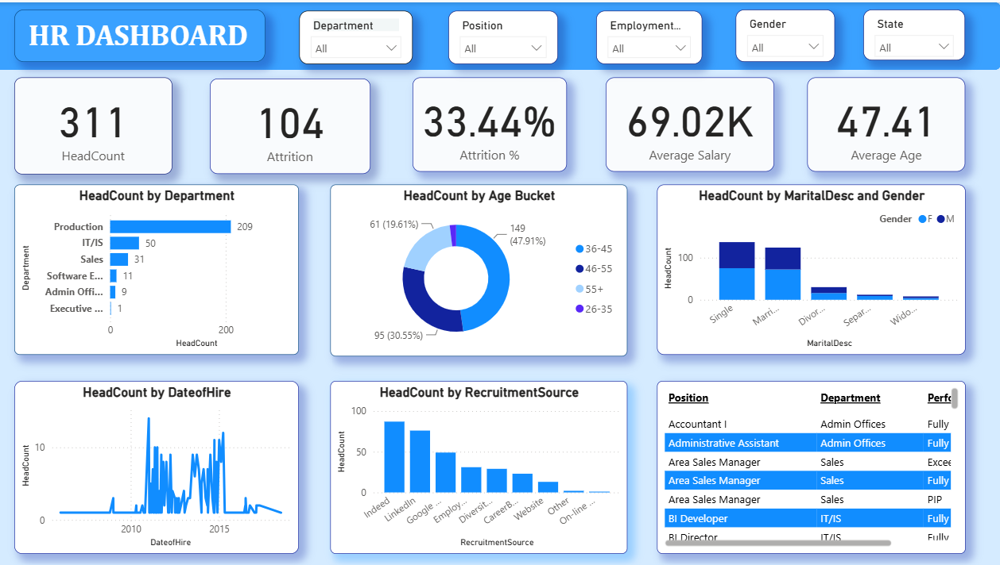

# 👥 HR Analytics Dashboard

A Power BI dashboard designed to monitor workforce metrics, track attrition trends, and support strategic HR decision-making across departments, roles, and demographics.

---

## 🛠️ Tech Stack

- **Power BI** — Dashboard design, DAX measures, and interactive slicers
- **Excel / CSV** — Data source (`HRDataset_v14.xlsx`)

---

## 📂 Data Source

Internal HR dataset (`HRDataset_v14.xlsx`) containing 311 employee records with attributes including department, position, recruitment source, salary, marital status, gender, and employment status.

---

## ✨ Highlights & Features

- **KPI Cards** — Instant view of headcount, attrition count, attrition %, average salary, and average age
- **Department Breakdown** — Bar chart showing headcount distribution across Production, IT/IS, Sales, and more
- **Age Bucket Analysis** — Donut chart segmenting workforce into age groups (26–35, 36–45, 46–55, 55+)
- **Marital Status & Gender** — Stacked bar chart comparing gender split across marital categories
- **Hiring Trends** — Line chart tracking headcount growth by date of hire (2008–2018)
- **Recruitment Source Analysis** — Bar chart ranking top hiring channels (Indeed, LinkedIn, Google, etc.)
- **Employee Table** — Scrollable position-level view with department and performance rating
- **Interactive Filters** — Slicers for Department, Position, Employment Type, Gender, and State

---

## 📈 Business Impact & Insights

- ⚠️ **High attrition risk** — A **33.44% attrition rate** signals urgent need for retention strategies
- 🏭 **Production-heavy workforce** — **67% of employees** are in Production, indicating operational dependency on a single department
- 📅 **Hiring surge mid-2010s** — Hiring peaked around **2013–2015**, useful for understanding workforce maturity and upcoming retirement waves
- 🔍 **Indeed & LinkedIn dominate hiring** — Top two sources account for the majority of recruits, informing future recruitment spend
- 👶 **Workforce skews mid-career** — **47.91% of employees are aged 36–45**, with limited young talent pipeline (26–35 at 30.55%)
- 💡 Insights support HR teams in **optimizing hiring channels, planning succession, reducing attrition, and improving workforce diversity**

---

## 📸 Dashboard Preview

